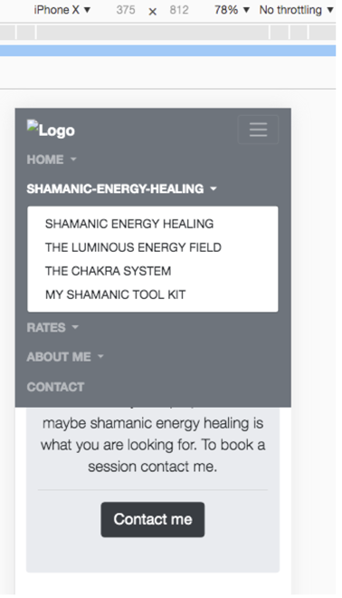

#  **THE SHAMAN'S CAT** 

>## **Project Overview**

A Shamanic Energy Healing practitioner is starting a new business in the UK. The main aim of the website is to generate clients for the practitioner. 

The website has been designed to provide potential clients with a basic understanding of the concepts and processes involved with this modality and their benefits. The potential client can then make an informed choice to contact the practitioner and book a healing session. The material is presented in a varied format; text, videos and pictures, in order to engage the potential clients. There are multiple links on each page guiding the potential client to make contact with the practitioner. 

### **Background to Project**
This site has been developed as a static frontend site using HTML5, CSS3 and Bootstrap, following the [Code Institute Project Guidelines.](https://helensayer.github.io/the-shamans-cat/assets/images/code-institute-guidlines-ms1.pdf) 
This is my first milestone project to demonstrate the skills I have learnt so far on the course.

 ### **Demo**

To view a live demo of the site click* on the link: https://helensayer.github.io/the-shamans-cat 

*_(To open in a new browser tab, right mouse click on the link and select **Open Link in a New Tab**)_

#### _Back to TOC anchor point_

>## **Table of Contents**

* [PROJECT OVERVIEW](#project-overview)
    * [Background to Project](#background-to-project)
    * [DEMO](#demo)   
* [UX STRATEGY](#ux-strategy)
    * [Business Goals](#business-goals)
    * [User Goals](#user-goals)
    * [B2C](#b2c)
    * [Audience](#audience)
    * [Location](#location)
    * [Research](#research)
    * [Potential Client Scenarios](#potential-client-scenarios)
    * [Product Considerations](#product-considerations)
    * [Finding this website](#finding-this-website)
    * [Strategy Trade-offs](#strategy-trade-offs)       
* [UX SCOPE](#ux-scope)
    * [User Stories](#user-stories)
    * [Content Specification](#content-specification)
     * [Functional Specifications](#functional-specifications)
* [UX STRUCTURE and SKELETON](#ux-structure-and-skeleton)
    * [Navigational Design and Hierarchy](#navigational-design-and-hierarchy)
    * [Wireframes](#wireframes)
* [UX SURFACE](#ux-surface)
    * [Visual Design](#visual-design)
    * [Fonts](#fonts)
    * [Colours](#colours)
* [FEATURES](#features) 
    * [Existing Features Common to Each Page](#existing-features-common-to-each-page) 
        * [Logo](#logo)
        * [Navigation bar](#navigation-bar)
        * [Hero Image with Jumbotron](#hero-image-with-jumbotron)
        * [Footer](#footer)
        * [Favicon](#favicon)
    * [Features individual to each page](#existing-features-on-individual-pages)
        * [Home page](#home-page)
        * [Shamanic Healing page](#shamanic-healing-page)
        * [About page](#about-page)
        * [Rates page](#rates-page)
        * [Contact page](#contact-page)
    * [Features Left to Implement](#features-left-to-implement)
* [TECHNOLOGIES USED](#technologies-used)
    * [Tools used](#tools-used)
* [TESTING](#testing)
    * [General Testing as Coding](#general-testing-as-coding)
    * [Testing User stories](#testing-user-stories)
    * [Bugs](#bugs)
* [DEPLOYMENT](#deployment)
    * [How to run the project code locally](#how-to-run-the-project-code-locally)
* [CREDITS](#credits)
    * [Content](#content)
    * [Media](#media)
    * [Code](#code)
    * [Acknowledgements](#acknowledgements)
* [DISCLAIMER](#disclaimer)

>## **UX Strategy** 

**UX Strategy** = **Design Strategy** + **Business Strategy**

**UX Strategy** - _**Focus:** - (What's worth doing?)_
* The Shamanic Energy Healing Practitioner is setting up a business and is looking for clients. They need an online presence to aid this process.

**Design Strategy**	- _**Definition:** - (What are we creating?)_
* Create a custom website for the practitioner.

**Business Strategy** - _**Value:** - (What value does it provide?)_ 

**Value to Business:**
* Establish an online presence so potential clients can find the practitioner. 
* Creates a brand for the practitioner so they can be identified over the competition. 
* Increases the practitioner’s client base by inspiring confidence in the potential clients to make contact and book a session. 
* The site acts as proof of ability of the practitioner to the potential clients. 
* In addition, social media links help promote the practitioner’s online presence.

**Value to Clients:**
* Become informed about this modality and its benefits. 
* Learn about the practitioner, her experience so they can decide if the practitioner is credible.
* Find out the cost of a session and decide if it is affordable.
* Contact the practitioner for either, more information, or to book a session.

***

### **Business Goals**

*   To increase number of clients for practitioner.
*	To establish an online presence for the practitioner.
*	To establish a brand, synonymous with the practitioner.
*	To inform potential clients about the healing processes, through articles, pictures and videos.
*	To make potential clients aware of the training and experience of the practitioner, through testimonials and a brief outline of the practitioner’s training in this field, in order to inspire confidence in the processes and the practitioner.
*	To engage potential clients so that they contact the practitioner and book a healing session.
*	Produce a blog with regular articles to attract new clients.
*	Existing clients are able to book follow-up sessions online. (Would not want new clients to book this way as the practitioner needs to initially assess each client.) 
*	To utilise User Experience Design (UXD) to ensure that potential clients encounter a positive user experience whilst visiting the site and want to follow through, by contacting the practitioner to book a session and may want to return to the site at a later time for information.

### **User Goals** 

*	To find a Shamanic Energy Healing practitioner by either arriving at the site through a word of mouth recommendation or via an online search and decide if they wish to work with the practitioner.
*	To learn more about Shamanic Energy Healing and decide if they would like to undertake this kind of healing.
*	To find out more about the practitioner and determine if they are credible to work with.
*	To be able to view the pricing structure and decide if a session is affordable.
*	To easily get in touch with the practitioner to book a healing session.
*	To be able to contact the practitioner for more information either through the site or via social media.
*   To be able to navigate through the site easily.
*   To be able to view the website on any device e.g. mobile, tablet, laptop, desktop.
___

[_Back to Top of TOC_](#back-to-toc-anchor-point)
___

### **B2C**
The website is a little different from a basic B2C site as the potential clients need reassurance, confidence and trust in the practitioner and the processes used during a session, to encourage them to make contact and/or book a healing session; they are not just influenced by emotion to make a quick impulse buy. They need a reasonable amount of background information in order to be able to make an informed choice about whether to have a healing session.

___

### **Audience**
The site is targeted at English speaking clients who are open to this type of healing and looking to find a shamanic energy healer. In this area of energy healing, clients tend to find their practitioners through word of mouth recommendations, then look for the site online to check details and make contact.

The age of the audience can vary but tends towards a mature type of client. There are more women looking for this type of energy healing than men. The user may be a computer novice. This information is based on the shamanic energy healer’s own experience, that of their fellow practitioners and potential users.

The website is informative to any user coming to the site wanting to know more about shamanic energy healing. 
‘Shaman’ is in the name of the website and along with other keywords in the site 
i.e. “shaman, shamanic, shamanic healer, energy healing, healer, Inca shamanism, Q'ero, Qero”, so search engines will pick up on these too. 
These types of visitors could also become clients.
___

### **Location**
The physical location of the practitioner is not an issue, as many types of session can be carried out remotely via the phone, skype and WhatsApp as well as by face to face sessions.

___

### **Research**
1. I talked to shamanic practitioners and potential clients and showed them my Ideas.

    Feedback: 
    *   I thought a carousel would be a good way of attracting clients to a section of the site they were most interested in. My research informed me that users did not like carousels and would not read most of the information. I checked this out with various web articles and found that research showed that carousels are not an effective way of promoting information or product as they get ignored by users, who get hit by banner blindness. This resulted in me not using a carousel on this website.
    * Users wanted a simple layout.

2. Looked at competitors’ websites to see how they were marketing themselves and the quality of their websites. 

* Some of these websites did not look that credible i.e.
    * looked homemade
    * old fashioned style
    * out of date information
    * missing favicons
    * non-responsive
    * poorly designed:
        * too much text or text unreadable over busy background pictures, 
        * terrible choices of colour schemes - that would give you a headache 
        * poorly cropped/focused pictures which did not relate to the text
        * difficult to find information
* On the other hand, some sites were very professional, custom made and looked very credible. These sites tend to belong to extremely successful Shamanic Practitioners who have large followings and, in some cases, give training. 
* Other sites of prominent Shaman are old-fashioned looking but due to the importance of the Shamanic practitioner, users are more interested in the content than what the page looked like.
3. In conclusion, this website needs the right amount of relevant, interesting and inspiring content, presented in a clear way which make it easy to read and navigate through, even for computer novices, leading the visitor to make contact with the practitioner.
___

[_Back to Top of TOC_](#back-to-toc-anchor-point)
___

### **Potential Client Scenarios**

* Recommended, potential client looking to make contact to book a shamanic energy healing session

* Potential client searching for a shamanic energy healer via the internet and wanting to check the credentials of the shamanic practitioner i.e. be inspired with confidence to use this person’s services over another practitioners.

* Someone searching on the internet about shamanism and related information, who lands on this site and then decides to book a shamanic energy healing session.

* Returning client looking for contact details or other information.

___

### **Product Considerations** 
*How to rise above the competition and make this site special.*

*	Mobile First, responsive approach to accommodate all user devices and screen types.
*   Navigation is easy and intuitive.
*	A simple clean consistent appearance, bright and uncluttered with an intuitive format and informative headlines. 
*   Text is in easy to read typefaces and contrasted appropriately.
*   Images are relevant to the content.
*	Keep the content to a minimum whilst still providing the user with sufficient information for them to feel they comprehend enough of the healing processes, and pricing structure, to be able to book a session. This includes the use of descriptive text, images, diagrams, videos, FAQs, testimonials and blogs.
*	Encourage users to return to the site for reference by providing good information and explanations.
*	Facilitate easy contact with practitioner so any questions and concerns can be dealt with promptly, paving the way for the user to book a session, use of Call-To-Actions (CTAs). Multiple contact routes via social media links, as well as a contact form.

___

### **Finding this Website**
How are potential clients going to find this website?
*	Word of mouth
*	Search Engines – need to use Search Engine Optimization (SEO) e.g. research and use keywords.
*	Add to Google Business
*	Add location to Google Maps
*	Cross-links to other sites
*	Blogs and articles 
*	Join reference sites
*	Subscription to listings
---

### **Strategy Trade-offs**
To work out what's worth having in the initial release of the website I used the strategy trade-off matrix. 

The first four Opportunities/Problems are possible at the moment with my current skillset. The last two will need additional skills that will be covered later on in the course. So I will produce a minimum-viable-product (MVP) implementing the four highest priorities listed in the table below. Future releases will include a blog and the ability for members i.e. existing clients, to book follow-up sessions via the website.

**Strategy Trade-off Priority Matrix Table**

___

[_Back to Top of TOC_](#back-to-toc-anchor-point)
___

>## **UX Scope**

The scope of the project is based on the strategy and the priorities identified in the strategy trade-offs.
Scope Includes the functional specifications and the content specifications.

### **User stories**
1.	As a first-time site visitor, I can find what I am looking for easily and find the site engaging. I can contact the practitioner to book a session or return to the site at a future date.
2.	As a site visitor, I can easily use the navigation bar to find out more details on shamanic-healing and decide if I want to contact this practitioner.
3.	As a site visitor, I can view the credentials of this shamanic healer, and decide if I want to contact them for a session or for more information.
4.	As a recommended potential client, I can find out about the shamanic practitioner, what sessions entail, read testimonials, view the pricing and then make contact via the contact form.
5.	As a potential client looking for a shamanic energy healer, I can find out about the shamanic healer, what sessions entail, read testimonials, view pricing and can contact the practitioner via the contact form to book a session.
6.	As a returning visitor, deciding to work with the practitioner, I can find the pricing and contact details easily.
7.	As any site visitor, I can check out the practitioner on social media by clicking on the social media icons in the footer.
8.	As any site visitor I can use the contact form to contact the practitioner and ask for information.

---

### **Content Specification**

The website needs the following content to accommodate the business goals and user requirements.

* **Online presence**
    * Establish a brand so easily distinguishable from competition
        * Use a Jaguar image – The shaman’s cat is a jaguar. The jaguar is an Inca shamanic archetype and represents the power of transformation.
        * Logo of Jaguar silhouette
        * Favicon of Jaguar silhouette
        * Social Media links to practitioner

* **Create trust** by establishing credentials of the shamanic practitioner and inspiring confidence in the potential clients, so they book a session.

* **Content requirements:**
To provide background information, important to the user in making informed choice about how to proceed.
The content is mixed including text, diagrams, photos and videos, so this breaks up the text to some extent. Due to there being a lot of text necessary to explain the background I have used various components from Bootstrap to breakup large chunks of text to make them more interesting and readable for the user. i.e. jumbotron, collapse, accordion and modals.
    * **Content Topics:**
        * The role of the shaman in modern society.
        * Why someone might benefit from a shamanic healing session?
        * Explanation of shamanic energy healing. 
        * Processes that can be used in a session.
        * What the client might expect from a shamanic energy healing session.
        * About the shamanic energy healing practitioner, including their training and experience.
        * Testimonials.
        * Photos showing the practitioner in training.
* **Rates** – Pricing - is it affordable?
* **FAQs** - inform user - is this something I want to do?
* **Contact** - Contact Form - to get in touch for more information or to book a session.
* **Medical Disclaimer, Privacy Statement and copyright Info** - business rules - legal

* _**What Research indicated**_
    * **No Carousel** - as I initially thought it was a good idea but this turned out not to be a good idea as the users did not like it.
    * **Simple Navigation** To move around the site.
    * **Easy to read text**

---

### **Functional Specifications**
The site enables users to carry out the tasks outlined in the user stories using the content outlined in content requirements and is aimed at fulfilling the business requirements. It will follow the guidelines below.
* **Responsive** - The site is developed using the mobile-first and a responsive approach, to ensure users on all devices have a good user-experience when visiting the site.
* The site is intuitive, so easily learnable, it uses consistent, predictable, interfaces and interactions, making it user friendly.
* **Navigation** - The navigation is conventional so that even a novice users can move between pages easily. 
    * **Menu** -  a fixed top navigation bar with logo on the left hand side and menu items aligned to the right, with text reading from left to right. A Burger menu icon on right hand side on devices with smaller screens. 
    * **clickable Logo** - allows users to return to the home page.
    * **Contact Buttons** - Allow users to move from each page to the contact form.
    * **Back-to-Top** - on each page allows users to return to the top of the page and the navigation menu. 
* **Hero Images** on each page to get the attention of the users. With informative text and call-to-action buttons.
* The site gives feedback where necessary e.g. if required fields not completed correctly in the contact form,  a message comes up informing the user what they need to do.
* The site is both engaging and inspiring keeping potential clients on the site. 
* For consistency and simplicity there are only two font-families used throughout the site. These are both clear and easy to read.
* Subtle background colours are used with the text to improve its readability as well as good contrast ratios.
* The site has good quality images and a simplistic uncluttered feel to it, which allows users to easily focus on the content.
* The site informs and educates the site visitor, so they gain a better understanding of shamanism and are hopefully more likely to book a session.
* The client is not overwhelmed with information yet can find what they need easily from the navigation bar, modal, collapse and accordion sections.
* The use of colourful visual elements such as the contact buttons, hero images and inspiring articles are directing the potential client to contact the shamanic practitioner. 
* The images help tell the story that is in the articles and any text on the pictures is clear and easy to read.  
___

[_Back to Top of TOC_](#back-to-toc-anchor-point)
___

>## **UX STRUCTURE and SKELETON**

### **Navigational Design and Hierarchy**

The content will be arranged on the site using a standard **tree structure** going down one level only. This reduces complexity as it reveals information and structure as the user navigates through the tree. It keeps the number of clicks, for a user to get to a destination, to under three clicks. This tree structure can be challenging on a mobile device, but this issue is resolved by using the convention of the Burger icon. The navigation elements collapse into this single Burger icon and are revealed when you click on the icon.

**Each page** has some identical components
*   **Header** - contains logo and menu
*   **Footer** - contains logo, contact button, social media links, Terms & Conditions, Privacy Policy, Copyright information.
*   **Hero image** with call-to-action, which takes the user to the contact form.
*   **Back-to-Top** - back to top anchor.

**Individual pages:**
*   **Home** - Background to Shamanic Healing.
*   **Shamanic Healing** - Healing systems and processes used.
*   **About** - About the practitioner - training, experience, testimonials.
*   **Rates** - Pricing and FAQs.
*   **Contact** - Contact form.

**Navigational Elements**
* **Menu** To enable users to navigate from whichever page they are on to any of the other pages of the site. The active page name in the menu is an off-white white to indicated to the user which page they are on. On rollover, a menu items changes to a lighter shade of grey.
* **Logo** The logo can be found on the left-hand-side (LHS) of nav-bar and in the footer. When clicked it takes the user back to the home page.
* **Back-to-Top/Top** This is a small white arrow on purple background, with 'Back-to-Top' text beneath it, located on the right-hand-side of the screen (text changes to 'Top' on smaller screens). When clicked this takes the user to the top of their current page. On hover the purple goes a darker shade.
* **Contact Buttons** Located on each page - take user to the contact form.
* **Social Media Icons** Located in the footer of each page, they connect the user to social media sites.
___
[_Back to Top of TOC_](#back-to-toc-anchor-point)
___

### **Features tried and taken off site because did not look good and/or work with the design concepts.**

**Dropdown Menus**

I did look at adding an additional layer to the tree structure but this looked messy, confusing and took up a lot of the screen on mobile devices e.g. 

**Search Functionality**
As there is a lot of information on the site I had wanted a search bar so that visitors could search for a specific topic or word, but the functionality of that is beyond the scope of this project. So, I thought I would experiment with a site directory to allow users to see and navigate to the major topics covered by the website. I did this by creating a blank nav-item and listing all the articles as dropdown items. I linked all the dropdown items with ids to the articles, installed smooth scroll and scrollspy to show the user where they were on the navigation. I also did not show it on small devices as it took up too much of the screen. My mentor was concerned that the user would not know what page they were on. So, I removed it and went back to a simple nav-item with no dropdowns. e.g. of site directory.

___

[_Back to Top of TOC_](#back-to-toc-anchor-point)
___

### **File Structure**

The **root directory** of the project contains:
  * **index.html** (Home)
  * **sh.html** (Shamanic-Healing)
  * **about.html**
  * **rates.html** 
  * **contact.html**
  * **README.md** 
  * **assets** subdirectory

 **assets** in turn has three subdirectories with the following content:
 * **css** - style.css
 * **images** - all image files for the website pages and the README.md
 * **wireframes** - a wireframe of each page showing view on mobile, tablet and desktop:
    * home.pdf
    * shamanic-healing.pdf
    * about-me.pdf
    * rates.pdf
    * contact.pdf
    
    

### **Information Design**

The information in the site is arranged in a logical way. Leading the user through the principles of shamanism, its benefits, how it works in detail, the experience of the practitioner, the cost, FAQs and how to contact the practitioner. It is done in this way as it provides answers to the questions a user might ask as they go through a decision process to determine if they want to book a session.

### **Wireframes**

The wireframes were made using Balsamiq and exported as pdf files and can be viewed following the links* below.

*_(To open wireframes links in a new browser tab, right mouse click on the link and select **Open Link in a New Tab**)_

* [Home](assets/wireframes/home.pdf)
* [Shamanic-Healing](assets/wireframes/shamanic-energy-healing.pdf)
* [About](assets/wireframes/about-me.pdf)
* [Rates](assets/wireframes/rates.pdf)
* [Contact](assets//wireframes/contact.pdf)
___

[_Back to Top of TOC_](#back-to-toc-anchor-point)
___

>## **UX SURFACE** 

*To view what the website looks like please go to the [Demo](#demo) section to see a mockup or to view a live demo, click* on the link: https://helensayer.github.io/the-shamans-cat.
 _(To open in a new browser tab, right mouse click on the link and select **Open Link in a New Tab**)_

### **Visual Design**
As there is a lot of information, I have presented it in a way that is not overwhelming to the user. I have done this by using a suitable amount of white space between text and images. It appears single column on smaller screened devices. On larger screened devices, on the Home, Shamanic-Healing and About pages i.e. those pages containing large amounts of information, I have split the the page beneath the hero image into two columns. In order that the text is broken up and not in one large block, thus making it easier to read and also look more interesting. I have added relevant pictures and videos to break the text up even further as wells as using the Bootstrap features of collapse, modals, card-deck and accordion.

### **Fonts**
To improve the look of the site from the default Bootstrap appearance, and to ensure the text is easy to read, the site uses fonts from Google Fonts; Raleway for the headings and Roboto for the main paragraph text. The proportions of the Roboto font make it easy to read and Raleway was designed for headings.

Sans-serif is used as a backup font-family if Roboto or Raleway should fail to load.

### **Colours**

 `#fefefa`  - BabyPowder - background-colour to `<body>` to make text easier to read as is an off-white so is easier on the eye.

 `#f8f8ff`  -   Used for background-color to the mission statement, to make it stand out from the normal text.

 `#8a2be2` BlueViolet - Used for contact buttons, a bright colour, to draw attention. It contrast well against the background.

 `#570790`  - a darker purple, used for contact buttons on hover.

 `#6d757d` Gray - Used for nav-bar and footer background-color, set by Bootstrap.

<!-- Code for colour placeholders is from https://placeholder.com/ -->

>## **FEATURES**

### **Existing Features Common to Each Page**

 

#### **Logo**
* Silhouette of Jaguar with text setting the brand - on every page top-right-hand side in the navigation bar, when clicked this acts as a link to the home page from any page on the website. There is also a logo in the footer of each page. When clicked this logo also acts as a link to the home page.

#### **Navigation bar**
* Fixed position at the top of the screen and reading from left to right, in a conventional manner, offering intuitive access to all pages of the website.  The navigation bar is responsive so it fills the width of the screen for any device. The menu text is replaced with a menu (Burger) icon, for mobile devices, which drops down over content when clicked. The active page is noted in the navigation bar by its name being white, as opposed to the inactive page names which are grey. They change to a lighter grey on hover.

#### **Hero Image with Jumbotron**
* Hero image with an overlaid jumbotron containing a text area on each page. The jumbotron has an opaque background so that the hero image is still visible but the text of the jumbotron is contrasted well for easy reading. The purpose of the hero image is to get the attention of the site visitor and draw them into the site. The hero image does not fill the entire vertical screen and shows there is more information below the fold, encouraging the user to scroll down the page. Below this text area is a call-to-action (CTA) button, for the user to contact the practitioner. The button is brightly coloured to get the attention of user. There is a different hero image and jumbotron text on each page, but with same layout format, which keeps a consistent feel across all the website pages.

#### **Footer**
**This is found at the bottom of every page and contains:**
*   Logo - When clicked takes user back to home page.
*   Contact button which when clicked leads to the contact form.
*   Social media icons - when clicked provide links to other social platforms used by the practitioner.
When the user hovers the mouse over the social media icons they change color to the real colours of icons for those sites.
*   A Terms & Condition's button - when clicked opens a modal, to clarify matters legally. When hovered over with the mouse the background of the button changes to white and the text changes from white to black.
*   A Privacy Policy button - when clicked opens a modal to clarify matters legally regarding the electronic storage of personal details. The modal behaves in the same way as the Terms & Conditions modal.
*   Copyright for protection of business data. This is just plane white text contrasting against the grey of the footer background-color.

 #### **Back-to-Top**
 * This anchor is in the form of a purple circle containing a white arrow with text **Back-to-Top** beneath it. It appears towards the bottom of each page on the right-hand-side, above the footer. When hovered over it changes colour to a darker purple. When clicked it allows the user to go to the top of the current page. It changes name to **Top** on smaller devices, so that it takes up less screen space. The z-index has been set so that it does not show on top of the hero image as this looked messy. The user is near the top of the page when on the hero image anyway.

#### **Favicon**
* Provides continuation of cat/jaguar branding to identify this site's webpages in browser tabs.
___

[_Back to Top of TOC_](#back-to-toc-anchor-point)
___

### **Existing Features on individual Pages**
#### Home page 

* Hero Image of a Peruvian sacred mountain - Salkantay.
* Jumbotron text setting context for call to action. The amount of text is increased on devices larger than mobiles.
* Article - What is Shamanic energy healing? 
    * Article with informative paragraphs of text. To avoid too much text on page a ‘read more’ button is used. This uses Bootstrap collapse feature.
    * A series of three short videos featuring Alberto Villoldo of The Four Winds Society describing modern shamanic healing. The videos are YouTube embedded and responsive. They are NOT set to play automatically. The user can use the normal YouTube controls and expand the video to full-screen if desired. 
    * Article - Benefits of Shamanic healing. This contains text outlining the benefits of this type of healing. To avoid too much text on page and overwhelming users, a ‘read more/less’ button is being used. This uses Bootstrap collapse feature.
    * Image of a butterfly that symbolizes transformation, which can occur with this healing modality. The image helps break up the text, and balances the screen on larger screened devices. 

#### Shamanic Healing page

* Hero Image - Theologue by the artist Alex Grey. Showing artists impression of energy in and around the body.
* Jumbotron text specific to the page - Shamanic Healing - briefly explains what the page is about.
* Article - Shamanic Healing - a more detailed look, with a video explaining some of the healing techniques used.  The video is YouTube embedded and responsive. It is NOT set to play automatically. The user can use the normal YouTube controls and expand the video to full-screen if desired. 
* Article - The Luminous Energy Field – image and text to give client a better understanding of terms and concepts used.
* Article - The Chakra System - image and text to give client a better understanding of terms and concepts used. To avoid too much text on page a ‘read more/less’ button is used. This uses Bootstrap collapse feature.
* Article - The Shaman's Mesa - image and text explaining what the mesa is and that it will be used in healing sessions.
* Healing Processes that can be used in a session. As there are ten processes, these were displayed using Bootstrap card-deck and modals, to break up text so it was in a better format for the user to digest. A block of standard text could have been overwhelming for the user, so this breaks it up into smaller neater sections and allows them to select the topic of interest to them. The card deck displays single column on mobile and two columns on devices larger than mobiles. The various processes are:
    * Illumination
    * Extraction
    * Soul Retrieval
    * Ancestral Healing
    * Cord Cutting
    * Transition Rites
    * Death Rites
    * Despacho
    * Destiny Retrieval
    * Fire Ceremony

#### About page

* Hero Image - The practitioner with her Q'ero teacher don Augustin and his family.
* Jumbotron text specific to the page - About Me - briefly explains what the page is about.
* Mission statement
    * Centred on a full-width section of page to draw attention to it.
    * Inspire potential clients.
* Article - My Journey – how the practitioner became a shamanic energy healing practitioner. Background to capture interest and build credibility.
* Article - My training – My formal training has been with The Four Winds Society https://thefourwinds.com/ - demonstrates practitioner's credibility. Quote from a magazine to demonstrate credibility of The Four Winds.
* Testimonials two items which change from single column (mobile) double column on tablets and larger screen sizes. Demonstrates practitioner's credibility.

#### Rates page 

* Hero Image - A ceremony/training session with the practitioner's Four Winds class at Moray, Cusco, Peru.
* Jumbotron text specific to the page - Rates and FAQs - clearly explains what is on the page.
* Contains a clear pricing structure, so the user can easily tell if a session is affordable.
* FAQs covering questions clients might ask. Uses Bootstrap's accordion to separate each FAQ and its answer. This breaks up blocks of text and makes it easier to read and for the user to find the information they are looking for.

#### Contact page 

* Hero Image - don Augustin and don Luis making a despacho offering.
* Jumbotron text specific to the page - Explaining there is a contact form below.
* Contact form requesting clients name, email, telephone number, topic and message. Each field, except the Skype ID, must be validated before user can send using the ‘Submit button’. If validation fails a message appears, prompting the user for the correct information to be entered.

### **Features Left to Implement**

 _**when I have developed the appropriate skills**_

* Complete the contact form so that it submits successfully and data is captured.
* Improved privacy policy so users can respond to GDPR compliance.
* [CAPTCHA](https://en.wikipedia.org/wiki/CAPTCHA) to avoid SPAM.
* Blog/newsletter with sign-up to attract new clients.
* Membership with login for existing clients.
* Online-booking of sessions for members.
* Search bar
* Online Payment for sessions at point of booking.
* Shop selling related books via links to Amazon.
___

[_Back to Top of TOC_](#back-to-toc-anchor-point)
___

>## **Technologies Used**

The following languages, frameworks and tools were used in the development of this site. HTML, CSS and Bootstrap provided the basic code for the site. Bootstrap classes were used as much as possible to save on writing new code in CSS.

* [**Cloud9 & AWS Cloud 9**](https://www.awseducate.com/signin/SiteLogin) is an online Integrated Development Environment IDE. Used as recommended by Code Institute. It provides a standardised environment for development. It was replaced as the recommended IDE by Gitpod.

* [**Gitpod IDE**](https://www.gitpod.io/) is an online IDE used as recommended by Code Institute. It provides a standardised environment for development. It was used with a Code Institute template, which sets up various extensions for the IDE which provide assistance to the coder e.g. Auto Close Tag, Bootstrap 4CDN Snippet, Prettier- Code Formatter. More can be added if required.

* [**HTML**](https://www.w3.org/html/) Hypertext Markup Language is a declarative programming language, used to provide structural elements to web pages.

* [**CSS**](https://www.w3.org/Style/CSS/Overview.en.html) is a declarative cascading style sheet programming language. Used to provide styling to html elements on a webpage.

* [**BOOTSTRAP Framework**](https://getbootstrap.com/) is a free, popular, opensource, CSS Framework for developing responsive and mobile-first websites. It contains CSS and JavaScript based design templates for typography, forms, buttons, navigation and other interface components. Used to help standardise and speed up development. Also provides features I am not yet skilled to create using JavaScript.

* [**FontAwesome**](https://fontawesome.com/start) is a font and icon toolkit which adds extra icons to enhance the appearance of the website.

* [**Google Fonts**](https://fonts.google.com/) is a library of free licensed fonts. Adds fonts to enhance the website and customize it from the standard bootstrap fonts.

* [**Popper.js**](https://popper.js.org/) is a positioning engine; its purpose is to calculate the position of an element to make it possible to position it near a given reference element. This is used by Bootstrap to produce Dropdowns for displaying and positioning i.e. navbar dropdown menus 

* [**jQuery**](https://jquery.com/) is a JavaScript library designed to simplify HTML DOM tree traversal and manipulation, as well as event handling, CSS animation, and Ajax. It is used by Bootstrap to reference JavaScript used by the navbar.

* [**Git**](https://git-scm.com/) is a distributed version-control system for tracking changes in source code during software development. The history of this website's development can be found in the Git log on my GitHub repository.

### **Tools used**
* [Balsamiq](https://balsamiq.com/wireframes/) - for making wireframes.
* [Favicon Generator](https://www.favicon-generator.org/) To generate a favicon appropriate to follow the branding of the site.
* [HTML Validator](https://validator.w3.org/) To validate HTML code. Used throughout development and to do final checks before project submission.
* [CSS Validator](https://jigsaw.w3.org/css-validator/) To validate CSS code. Used throughout development and to do final checks before project submission.
* [Google Mobile-Friendly Test](https://search.google.com/test/mobile-friendly) - Tests how easily a visitor can use your page on a mobile device.
* [AutoPrefixer](https://autoprefixer.github.io/) is a PostCSS plugin which parses your CSS and adds vendor prefixes to ensure css code works in different browsers.
* [PhotoShop Elements](https://www.adobe.com/uk/products/photoshop-premiere-elements.html) used to resize, and prepare images for the web.
* [TinyPNG](https://tinypng.com/) to compress image files to reduce their size which in turn reduces the images load time on the webpage.
* [Code Spell Checker](https://marketplace.visualstudio.com/items?itemName=streetsidesoftware.code-spell-checker) in Gitpod to check spelling as you type.
* Chrome DevTools and Safari Developer Tools available from browser.
* Lighthouse - Lighthouse is an open-source, automated tool for improving the quality of web pages. You can run it from Chrome DevTools against any web page, public or requiring authentication. It has audits for performance, accessibility, progressive web apps, SEO and more.
* [ally](https://color.a11y.com/) to test color contrast is optimized.
___

[_Back to Top of TOC_](#back-to-toc-anchor-point)
___

>## **Testing**

### **General Testing as Coding**

**Error Checking:**
Gitpod indicates problem as you develop code. Chrome Dev tools indicates errors in the console too. So any errors can be eliminated immediately where possible. The site pages have also been tested with appropriate validators and produce no errors, [HTML Validator](https://validator.w3.org/) and [CSS Validator](https://jigsaw.w3.org/css-validator/).

**Spelling:** I write my content text chunks in word, so they are spelling free when loaded to the website. I also have installed [Code Spell Checker](https://marketplace.visualstudio.com/items?itemName=streetsidesoftware.code-spell-checker) onto Gitpod to help avoid spelling mistakes and typos while I am coding.

**Chrome Dev Tools:**
I use Chrome to monitor and test the code as I develop. So I check new code straight away and make sure that it is working responsively on each of the mobile devices listed in Dev Tools and on larger break-points too.
___

### **Testing User stories**
_**1.	As a first-time site visitor, I can find what I am looking for easily and find the site engaging. I can contact the practitioner to book a session or return to the site at a future date.**_

**Navigation**
*   When the visitor lands on the home page, or any page, they can locate the navigation bar easily and use its menu to move to and from any other page on the site.
*   The user can identify which page they are on, the active page, by that page name being highlighted in the navigation bar. The navigation bar is fixed so is always available for reference as the user scrolls up and down the page.
*   If the user needs to return to the top of the current page they can click the 'Back-to-Top' or 'Top'  arrow, which is towards the bottom, right-hand-side of the screen.
*   On any page the user can click on the logo, in the navigation bar or the footer, to return to the home page of the site.

**Contacting the Practitioner**
*   If the visitor wants to contact the practitioner they can do this by filling out and submitting the contact form. They can navigate to the contact form by:    
    *   Selecting the 'Contact' page from the navigation bar menu and scrolling down the page to the contact form or click on the 'Contact Form' button in the jumbotron section of this page, which jumps to the contact form section of this page.
    *   Clicking on the 'Contact me' button in the hero/jumbotron section, on the Home, Shamanic-Healing, About or Rates pages takes the user directly to the contact form.
    *   Clicking on the 'Contact me' button in the footer of any page takes the user directly to the contact form.
    *   Clicking on the 'Contact me to book a session' button on the Rates page takes the user directly to the contact form.

**Contact Form**    
*   Once on the Contact form:
    *   If the user tries to submit the form without filling in any required details or with missing required details, they will be directed back to the first of the required input fields which is missing data. This field will be highlighted and a pop-up message may  appear attached to this field, prompting the user to '! Please fill in this field'.
    *   If the user misses out the @ symbol in the email address. The user will not be able to submit the form until a valid email format has been entered. In Chrome a prompt will appear '! Please include an '@' in the email address.'
    *   If the user tries to submit the form without selecting a message topic they will be prompted to fill in this field. In chrome they will get the  following message, '! Please select an item in the list.'
    *   Currently there is not a success message for successful submission of the form as the form needs connecting to a server set up to handle the data from the form. This is beyond the scope of this project.

    *(The prompt is different in different browsers. In Firefox - the field is highlighted but there is no message. The field remains highlighted until completed correctly.)

  **Engaging**  
* The site has been laid out to include text, videos and pictures, using plenty of space between items to allow for an uncluttered feel, while remaining informative and interesting to keep the user engaged with the site. Various Bootstrap features have been used to break up text, so that is not overwhelming to the user yet still provides sufficient information for the user to be encouraged to book a session.
___

[_Back to Top of TOC_](#back-to-toc-anchor-point)
___

_**2.	As a site visitor, I can easily use the navigation bar to find out more details on shamanic-healing and decide if I want to contact this practitioner.**_

*   How the user uses the navigation and the contact form are described in the point above. 
*   When the user arrives at the Home page, the title of the section below the hero-image is set to show just above the fold on most devices; the title is 'What is Shamanic Energy Healing?' so the user can immediately scroll down and read more about this.
    *    The user can choose to watch the three videos on the page which explain modern shamanism. The user can click on the red arrow on the video to start watching, they can also choose to use the YouTube controls within the embedded video i.e. stop/start, pause, control the sound, or view in full-screen mode.
    *   The text is broken into smaller sections using Bootstrap collapse the 'Read more/less' buttons, which work allowing the user to reveal/cover-up additional text.
 *   One of the pages is called Shamanic-Healing so the user can navigate straight to this page. The hero image area on this page contains text describing the page - 'Healing systems and processes use.' So the user can scroll down the page to find out more.
        *  As the user scrolls down the page, there is a video explaining some of the techniques used during a session. The video has the same YouTube features as described above.
        *   The Healing Processes section is laid out using Bootstrap cards and modals, so when the user selects a healing process they wish to learn more about they click on the 'Read More' button at the bottom of the card and it opens a modal containing more text relating to this process. The modal can be closed either by clicking on the cross in the top-right-hand corner of the modal, or by clicking on the close button at the base of the modal text.

_**3.	As a site visitor, I can view the credentials of this shamanic healer, and decide if I want to contact them for a session or for more information.**_

*   The user can see from the navigation bar that there is an About page. They can navigate there easily and check out the practitioner to decide if they are credible. The About page has a mission statement for the practitioner, as well as inspiring articles about the practitioner's training, their experience and client testimonials, to provide information to establish the practitioners credibility.
*   Once on the About page they can navigate to the contact form by clicking on either of the contact buttons, one on the hero image and the other in the footer, or by selecting the Contact page from the navigation bar menu.

_**4.	As a recommended potential client, I can find out about the shamanic practitioner, what sessions entail, read testimonials, view the pricing and then make contact via the contact form.**_

 _and_

_**5.	As a potential client looking for a shamanic energy healer, I can find out about the shamanic healer, what sessions entail, read testimonials, view pricing and can contact the practitioner via the contact form to book a session.**_

*   The user can easily navigate the site to find out about the practitioner from the About page as described in the point 3 - above.
*   The user can navigate to the Rates page using the navigation bar menu from any page on the site. 
*   The Rates page indicates, in the jumbotron text on the hero image, that it contains Rates and FAQs, which the user sees when they open the page. They can then scroll down to read the pricing information, cancellation policy, and the FAQs.
*   The FAQs are displayed in Bootstrap accordion component which breaks up the text so not one large block overwhelming the user. The user clicks on the question they want to reveal the answer to. The question text becomes bold, to indicate to the user the question that has been selected. A drop down section appears directly beneath the active question. On selecting another question the previously selected question closes and the new one opens.
*   If they choose, the user can then contact the practitioner by the 'Contact me to book a session' button directly above the FAQs section, or by the other two 'contact me' buttons, (one in the hero image jumbotron or the one in the footer) or via the Contact page and complete the contact form as described above.

_**6.	As a returning visitor, deciding to work with the practitioner, I can find the pricing and contact details easily.**_

*   The user arrives at the site and can navigate to the Rates page using the navigation bar menu from any page on the site.
*   The user can scroll down and find all the information on pricing for a session.
*   Once the user has decided if the prices obtained are affordable they can move to Contact page via: The 'Contact me to book a session' button directly above the FAQs section on the Rates page, or by one of the other two 'contact me' buttons, (one in the hero image jumbotron or one in the footer) or via the Contact page and complete the contact form as described above.

_**7.	As any site visitor, I can check out the practitioner on social media by clicking on the social media icons in the footer.**_

*   The user may use the social media buttons located in the footer on every page. These will take the user to the practitioner's page on these platforms. NB: not all social media has been set up with the practitioner’s direct link as this is site is only for educational purposes and not a live working site. The links will take the user to the application only in most cases.
    *   The social media icons will change colour to the true application's colour when hovered over by the user to indicate which icon is being selected.  

_**8.	As any site visitor I can use the contact form to contact the practitioner and ask for information.**_

*   The visitor arrives on the site and can immediately see that there is a contact page. They can navigate there using the menu or any of the 'contact me' buttons found on each page.
*    Having moved to the contact form. The user can complete the required fields and choose the message topic from the dropdown list 'I would like more information about..' The fill in the message section with their request.
___

[_Back to Top of TOC_](#back-to-toc-anchor-point)
___

### **Manual Functionality Testing**

_**Physical Devices used for Testing**_

*   **iPhone 8,** running iOS 13.61

* **iMac (Retina 5K, 27-inch 2019,** running macOS Catalina 10.15.6 
    - Chrome Version 85.0.4183.83 (Official Build) (64-bit)
    - Safari version 13.1.2
    - Firefox version 80.0 (64-bit)
    - Microsoft Edge was tested in Safari running MS Edge

* **HP Pavilion 32 80 cm (31.5") monitor** 2560 x 1440 pixels Quad HD LED

* **Acer Aspire running windows 10,** display resolution 1366 x 768
    - Chrome version 84.0.4147.135
    - Microsoft Edge version 84.0.522.61

* **Huawei Y7 2018,** screen 1440 x 720
    -   O/S Android 8.0.0
    -   Chrome 84.0.4147.125

#### **Browsers**

Page|Feature|Browser||||
|:---|:---|:---|:---|:---|:---|
|||Chrome|Safari|Firefox|Microsoft Edge|
|_**Home Page**_||||||
||**Navigation**|||||
||Menu|passed|passed|passed|passed|
||Logo|passed|passed|passed|passed|
||Back-to-Top|passed|passed|passed|passed|
||**Footer**|||||
||Logo|passed|passed|passed|passed|
||'Contact me' button|passed|passed|passed|passed|
||Social Media Icons|passed|passed|passed|passed|
||Terms & Conditions Modal|passed|passed|passed|passed|
||Privacy Policy Modal|passed|passed|passed|passed|
||**Content**|||||
||Hero Image|passed|Initially Failed*|passed|passed|
||Jumbotron|passed|passed|passed|passed|
||'Contact me' button|passed|passed|passed|passed|
||Text|passed|passed|passed|passed|
||Videos|passed|passed|passed|passed|
||Collapse Read more/less|passed|passed|passed|passed|
|_**Shamanic-Healing Page**_|||||
||**Navigation**|||||
||Menu|passed|passed|passed|passed|
||Logo|passed|passed|passed|passed|
||Back-to-Top|passed|passed|passed|passed|
||**Footer**|||||
||Logo|passed|passed|passed|passed|
||'Contact me' button|passed|passed|passed|passed|
||Social Media Icons|passed|passed|passed|passed|
||Terms & Conditions Modal|passed|passed|passed|passed|
||Privacy Policy Modal|passed|passed|passed|passed|
||**Content**|||||
||Hero Image|passed|Initially Failed*|passed|passed|
||Jumbotron|passed|passed|passed|passed|
||'Contact me' button|passed|passed|passed|passed|
||Text|passed|passed|passed|passed|
||Video|passed|passed|passed|passed|
||Collapse Read more/less|passed|passed|passed|passed|
||Healing Processes card and modals|passed|passed|passed|passed|
|_**About Page**_|||||
||**Navigation**|||||
||Menu|passed|passed|passed|passed|
||Logo|passed|passed|passed|passed|
||Back-to-Top|passed|passed|passed|passed|
||**Footer**|||||
||Logo|passed|passed|passed|passed|
||'Contact me' button|passed|passed|passed|passed|
||Social Media Icons|passed|passed|passed|passed|
||Terms & Conditions Modal|passed|passed|passed|passed|
||Privacy Policy Modal|passed|passed|passed|passed|
||**Content**|||||
||Hero Image|passed|Initially Failed*|passed|passed|
||Jumbotron|passed|passed|passed|passed|
||'Contact me' button|passed|passed|passed|passed|
||Text|passed|passed|passed|passed|
||Collapse Read more/less|passed|passed|passed|passed|
||Testimonials|passed|passed|passed|passed|
|_**Rates Page**_|||||
||**Navigation**|||||
||Menu|passed|passed|passed|passed|
||Logo|passed|passed|passed|passed|
||Back-to-Top|passed|passed|passed|passed|
||**Footer**|||||
||Logo|passed|passed|passed|passed|
||'Contact me' button|passed|passed|passed|passed|
||Social Media Icons|passed|passed|passed|passed|
||Terms & Conditions Modal|passed|passed|passed|passed|
||Privacy Policy Modal|passed|passed|passed|passed|
||**Content**|||||
||Hero Image|passed|Initially Failed*|passed|passed|
||Jumbotron|passed|passed|passed|passed|
||'Contact me' button|passed|passed|passed|passed|
||Text|passed|passed|passed|passed|
||'Contact me to book a session' button|passed|passed|passed|passed|
||FAQs Accordion|passed|passed|passed|passed|
|_**Contact Page**_|||||
||**Navigation**|||||
||Menu|passed|passed|passed|passed|
||Logo|passed|passed|passed|passed|
||Back-to-Top|passed|passed|passed|passed|
||**Footer**|||||
||Logo|passed|passed|passed|passed|
||'Contact me' button|passed|passed|passed|passed|
||Social Media Icons|passed|passed|passed|passed|
||Terms & Conditions Modal|passed|passed|passed|passed|
||Privacy Policy Modal|passed|passed|passed|passed|
||**Content**|||||
||Hero Image|passed|Initially Failed*|passed|passed|
||Jumbotron|passed|passed|passed|passed|
||'Contact me' button|passed|passed|passed|passed|
||Contact Form|passed|passed|passed|passed|

*Initially Failed - Hero Image [See fix](#bugs). Now working ok.
___

[_Back to Top of TOC_](#back-to-toc-anchor-point)
___

#### **Responsive Testing on Different Devices via Chrome Dev Tools**
___
|_**Home Page**_|||||||||||||||
|:---|:---|:---|:---|:---|:---|:---|:---|:---|:---|:---|:---|:---|:---|:---|
|Feature/Devices|Moto G4|Galaxy S5|Pixel 2|Pixel 2 XL|iPhone 5/SE|iPhone 6/7/8|iPhone 6/7/8 Plus|iPhone X|iPad|iPad Pro|Surface Duo|Galaxy Fold| Break point 1200|Break point 1440|
|**Navigation**|||||||||||||||
|Menu|passed|passed|passed|passed|passed|passed|passed|passed|passed|passed|passed|passed|passed|passed|
|Logo|Initially Failed*|Initially Failed*|Initially Failed*|Initially Failed*|Initially Failed*|Initially Failed*|Initially Failed*|Initially Failed*|Initially Failed*|Initially Failed*|Initially Failed*|Initially Failed*|passed|passed|
|Back-to-Top|passed|passed|passed|passed|passed|passed|passed|passed|passed|passed|passed|passed|passed|passed|
|**Footer**|||||||||||||||
|Logo|Initially Failed*|Initially Failed*|Initially Failed*|Initially Failed*|Initially Failed*|Initially Failed*|Initially Failed*|Initially Failed*|Initially Failed*|Initially Failed*|Initially Failed*|Initially Failed*|passed|passed|
|'Contact me' button|passed|passed|passed|passed|passed|passed|passed|passed|passed|passed|passed|passed|passed|passed|
|Social Media Icons|passed|passed|passed|passed|passed|passed|passed|passed|passed|passed|passed|passed|passed|passed|
|Terms & Conditions Modal|passed|passed|passed|passed|passed|passed|passed|passed|passed|passed|passed|passed|passed|passed|
|Privacy Policy Modal|passed|passed|passed|passed|passed|passed|passed|passed|passed|passed|passed|passed|passed|passed|
|**Content**|||||||||||||||
|Hero Image|passed|passed|passed|passed|passed|passed|passed|passed|passed|passed|passed|passed|passed|passed|
|Jumbotron|Initially Failed in L*|Initially Failed in L*|Initially Failed in L*|Initially Failed in L*|Initially Failed P & L*|Initially Failed in L*|Initially Failed in L*|Initially Failed in L*|passed|passed|passed|Initially Failed in L*|passed|passed|
|'Contact me' button|passed|passed|passed|passed|passed|passed|passed|passed|passed|passed|passed|passed|passed|passed|
|Text|passed|passed|passed|passed|passed|passed|passed|passed|passed|passed|passed|passed|passed|passed|
|Videos|passed|passed|passed|passed|passed|passed|passed|passed|Initially Failed in L*|Initially Failed in P*|passed|passed|Initially Failed*|passed|
|Collapse Read more/less|passed|passed|passed|passed|passed|passed|passed|passed|passed|passed|passed|passed|passed|passed|
___
|_**Shamanic-Healing Page**_|||||||||||||||
|:---|:---|:---|:---|:---|:---|:---|:---|:---|:---|:---|:---|:---|:---|:---|
|Feature/Devices|Moto G4|Galaxy S5|Pixel 2|Pixel 2 XL|iPhone 5/SE|iPhone 6/7/8|iPhone 6/7/8 Plus|iPhone X|iPad|iPad Pro|Surface Duo|Galaxy Fold| Break point 1200|Break point 1440|
|**Navigation**|||||||||||||||
|Menu|passed|passed|passed|passed|passed|passed|passed|passed|passed|passed|passed|passed|passed|passed|
|Logo|Initially Failed*|Initially Failed*|Initially Failed*|Initially Failed*|Initially Failed*|Initially Failed*|Initially Failed*|Initially Failed*|Initially Failed*|Initially Failed*|Initially Failed*|Initially Failed*|passed|passed|
|Back-to-Top|passed|passed|passed|passed|passed|passed|passed|passed|passed|passed|passed|passed|passed|passed|
|**Footer**|||||||||||||||
|Logo|Initially Failed*|Initially Failed*|Initially Failed*|Initially Failed*|Initially Failed*|Initially Failed*|Initially Failed*|Initially Failed*|Initially Failed*|Initially Failed*|Initially Failed*|Initially Failed*|passed|passed|
|'Contact me' button|passed|passed|passed|passed|passed|passed|passed|passed|passed|passed|passed|passed|passed|passed|
|Social Media Icons|passed|passed|passed|passed|passed|passed|passed|passed|passed|passed|passed|passed|passed|passed|
|Terms & Conditions Modal|passed|passed|passed|passed|passed|passed|passed|passed|passed|passed|passed|passed|passed|passed|
|Privacy Policy Modal|passed|passed|passed|passed|passed|passed|passed|passed|passed|passed|passed|passed|passed|passed|
|**Content**|||||||||||||||
|Hero Image|passed|passed|passed|passed|passed|passed|passed|passed|passed|passed|passed|passed|passed|passed|
|Jumbotron|Initially Failed in L*|Initially Failed in L*|passed|passed|Initially Failed in L*|passed|passed|passed|passed|passed|passed|Initially Failed in L*|passed|passed|
|'Contact me' button|passed|passed|passed|passed|passed|passed|passed|passed|passed|passed|passed|passed|passed|passed|
|Text|passed|passed|passed|passed|passed|passed|passed|passed|passed|passed|passed|passed|passed|passed|
|Video|passed|passed|passed|passed|passed|passed|passed|passed|passed|passed|passed|passed|passed|passed|
|Collapse Read more/less|passed|passed|passed|passed|passed|passed|passed|passed|passed|passed|passed|passed|passed|passed|
|Healing Processes card and modals|passed|passed|passed|passed|passed|passed|passed|passed|passed|passed|passed|passed|passed|passed|
___
|_**About Page**_|||||||||||||||
|:---|:---|:---|:---|:---|:---|:---|:---|:---|:---|:---|:---|:---|:---|:---|
|Feature/Devices|Moto G4|Galaxy S5|Pixel 2|Pixel 2 XL|iPhone 5/SE|iPhone 6/7/8|iPhone 6/7/8 Plus|iPhone X|iPad|iPad Pro|Surface Duo|Galaxy Fold| Break point 1200|Break point 1440|
|**Navigation**|||||||||||||||
|Menu|passed|passed|passed|passed|passed|passed|passed|passed|passed|passed|passed|passed|passed|passed|
|Logo|Initially Failed*|Initially Failed*|Initially Failed*|Initially Failed*|Initially Failed*|Initially Failed*|Initially Failed*|Initially Failed*|Initially Failed*|Initially Failed*|Initially Failed*|Initially Failed*|passed|passed|
|Back-to-Top|passed|passed|passed|passed|passed|passed|passed|passed|passed|passed|passed|passed|passed|passed|
|**Footer**|||||||||||||||
|Logo|Initially Failed*|Initially Failed*|Initially Failed*|Initially Failed*|Initially Failed*|Initially Failed*|Initially Failed*|Initially Failed*|Initially Failed*|Initially Failed*|Initially Failed*|Initially Failed*|passed|passed|
|'Contact me' button|passed|passed|passed|passed|passed|passed|passed|passed|passed|passed|passed|passed|passed|passed|
|Social Media Icons|passed|passed|passed|passed|passed|passed|passed|passed|passed|passed|passed|passed|passed|passed|
|Terms & Conditions Modal|passed|passed|passed|passed|passed|passed|passed|passed|passed|passed|passed|passed|passed|passed|
|Privacy Policy Modal|passed|passed|passed|passed|passed|passed|passed|passed|passed|passed|passed|passed|passed|passed|
|**Content**|||||||||||||||
|Hero Image|passed|passed|passed|passed|passed|passed|passed|passed|passed|passed|passed|passed|passed|passed|
|Jumbotron|Initially Failed in L*|Initially Failed in L*|passed|passed|Initially Failed in L*|Initially Failed in L*|passed|Initially Failed in L*|passed|passed|passed|Initially Failed in L*|passed|passed|
|'Contact me' button|passed|passed|passed|passed|passed|passed|passed|passed|passed|passed|passed|passed|passed|passed|
|Text|passed|passed|passed|passed|passed|passed|passed|passed|passed|passed|passed|passed|passed|passed|
|Collapse Read more/less|passed|passed|passed|passed|passed|passed|passed|passed|passed|passed|passed|passed|passed|passed|
|Testimonials|passed|passed|passed|passed|passed|passed|passed|passed|passed|passed|passed|passed|passed|passed|
___
|_**Rates Page**_|||||||||||||||
|:---|:---|:---|:---|:---|:---|:---|:---|:---|:---|:---|:---|:---|:---|:---|
|Feature/Devices|Moto G4|Galaxy S5|Pixel 2|Pixel 2 XL|iPhone 5/SE|iPhone 6/7/8|iPhone 6/7/8 Plus|iPhone X|iPad|iPad Pro|Surface Duo|Galaxy Fold| Break point 1200|Break point 1440|
|**Navigation**|||||||||||||||
|Menu|passed|passed|passed|passed|passed|passed|passed|passed|passed|passed|passed|passed|passed|passed|passed|
|Logo|Initially Failed*|Initially Failed*|Initially Failed*|Initially Failed*|Initially Failed*|Initially Failed*|Initially Failed*|Initially Failed*|Initially Failed*|Initially Failed*d|Initially Failed*|Initially Failed*|passed|passed|
|Back-to-Top|passed|passed|passed|passed|passed|passed|passed|passed|passed|passed|passed|passed|passed|passed|
|**Footer**|||||||||||||||
|Logo|Initially Failed*|Initially Failed*|Initially Failed*|Initially Failed*|Initially Failed*|Initially Failed*|Initially Failed*|Initially Failed*|Initially Failed*|Initially Failed*|Initially Failed*|Initially Failed*|passed|passed|
|'Contact me' button|passed|passed|passed|passed|passed|passed|passed|passed|passed|passed|passed|passed|passed|passed|
|Social Media Icons|passed|passed|passed|passed|passed|passed|passed|passed|passed|passed|passed|passed|passed|passed|
|Terms & Conditions Modal|passed|passed|passed|passed|passed|passed|passed|passed|passed|passed|passed|passed|passed|passed|
|Privacy Policy Modal|passed|passed|passed|passed|passed|passed|passed|passed|passed|passed|passed|passed|passed|passed|
|**Content**|||||||||||||||
|Hero Image|passed|passed|passed|passed|passed|passed|passed|passed|passed|passed|passed|passed|passed|passed|passed|passed|
|Jumbotron||passed|passed|passed|Initially Failed in L*|passed|passed|passed|passed|passed|passed|Initially Failed in L*|passed|passed|passed|passed|passed|
|'Contact me' button|passed|passed|passed|passed|passed|passed|passed|passed|passed|passed|passed|passed|passed|passed|
|Text|passed|passed|passed|passed|passed|passed|passed|passed|passed|passed|passed|passed|passed|passed|
|'Contact me to book a session' button|passed|passed|passed|passed|passed|passed|passed|passed|passed|passed|passed|passed|passed|passed|
|FAQs Accordion|passed|passed|passed|passed|passed|passed|passed|passed|passed|passed|passed|passed|passed|passed|
___
|_**Contact Page**_|||||||||||||||
|:---|:---|:---|:---|:---|:---|:---|:---|:---|:---|:---|:---|:---|:---|:---|
|Feature/Devices|Moto G4|Galaxy S5|Pixel 2|Pixel 2 XL|iPhone 5/SE|iPhone 6/7/8|iPhone 6/7/8 Plus|iPhone X|iPad|iPad Pro|Surface Duo|Galaxy Fold| Break point 1200|Break point 1440|
|**Navigation**|||||||||||||||
|Menu|passed|passed|passed|passed|passed|passed|passed|passed|passed|passed|passed|passed|passed|passed|
|Logo|Initially Failed*|Initially Failed*|Initially Failed*|Initially Failed*|Initially Failed*|Initially Failed*|Initially Failed*|Initially Failed*|Initially Failed*|Initially Failed*|Initially Failed*|Initially Failed*|passed|passed|
|Back-to-Top|passed|passed|passed|passed|passed|passed|passed|passed|passed|passed|passed|passed|passed|passed|
|**Footer**|||||||||||||||
|Logo|Initially Failed*|Initially Failed*|Initially Failed*|Initially Failed*|Initially Failed*|Initially Failed*|Initially Failed*|Initially Failed*|Initially Failed*|Initially Failed*|Initially Failed*|Initially Failed*|passed|passed|
|'Contact me' button|passed|passed|passed|passed|passed|passed|passed|passed|passed|passed|passed|passed|passed|passed|
|Social Media Icons|passed|passed|passed|passed|passed|passed|passed|passed|passed|passed|passed|passed|passed|passed|
|Terms & Conditions Modal|passed|passed|passed|passed|passed|passed|passed|passed|passed|passed|passed|passed|passed|passed|
|Privacy Policy Modal|passed|passed|passed|passed|passed|passed|passed|passed|passed|passed|passed|passed|passed|passed|
|**Content**|||||||||||||||
|Hero Image|passed|passed|passed|passed|passed|passed|passed|passed|passed|passed|passed|passed|passed|passed|
|Jumbotron|Initially Failed in L*|Initially Failed in L*|Initially Failed in L*|Initially Failed in L*|Initially Failed in L*|Initially Failed in L*|Initially Failed in L*|Initially Failed in L*|passed|passed|passed|Initially Failed in L*|passed|passed|
|'Contact me' button|passed|passed|passed|passed|passed|passed|passed|passed|passed|passed|passed|passed|passed|passed|
|Contact Form|passed|passed|passed|passed|passed|passed|passed|passed|passed|passed|passed|passed|passed|passed|

*Initially Failed - These issues have now been addressed successfully and the current status is passed. [See fixes](#bugs)

*L = Landscape mode; *P = Portrait mode.xs
___

[_Back to Top of TOC_](#back-to-toc-anchor-point)
___

**Chrome Dev Tools Console Warnings**

On the Home and Shamanic-healing pages I get the following warning relating to the embedded videos from YouTube:

* A cookie associated with a cross-site resource at http://youtube.com/ was set without the `SameSite` attribute. It has been blocked, as Chrome now only delivers cookies with cross-site requests if they are set with `SameSite=None` and `Secure`. You can review cookies in developer tools under Application>Storage>Cookies and see more details at https://www.chromestatus.com/feature/5088147346030592 and https://www.chromestatus.com/feature/5633521622188032.
This is a warning and does not stop the site functioning. The fix is beyond the scope of this project.

On every page I get the following error:
* DevTools failed to load SourceMap: Could not load content for https://cdnjs.cloudflare.com/ajax/libs/twitter-bootstrap/4.5.2/css/bootstrap.min.css.map: HTTP error: status code 404, net::ERR_HTTP_RESPONSE_CODE_FAILURE
* DevTools failed to load SourceMap: Could not load content for https://cdnjs.cloudflare.com/ajax/libs/twitter-bootstrap/4.5.2/js/bootstrap.min.js.map: HTTP error: status code 404, net::ERR_HTTP_RESPONSE_CODE_FAILURE

This does not affect the functionality of the site.

#### **Chrome Lighthouse Testing**
Lighthouse is an open-source, automated tool for improving the quality of web pages. I ran it against the pages of this site. I used it to audit for: performance, accessibility, best practices and SEO.

Page|Performance|Accessibility|Best Practices|SEO|
|:---|:---|:---|:---|:---|
|_**Home Page**_|||||
|Mobile|87|100|92|100|
|Desktop|99|98|100|100|
|_**Shamanic-Healing Page**_|||||
|Mobile|75|100|92|100|
|Desktop|92|98|100|100|
|_**About Page**_|||||
|Mobile|84|100|92|100|
|Desktop|99|98|100|100|
|_**Rates Page**_|||||
|Mobile|84|100|92|100|
|Desktop|99|98|100|100|
|_**Contact Page**_|||||
|Mobile|93|100|92|100|
|Desktop|100|98|100|100|

_**Issues from Lighthouse test**_

**Performance:**
Page load times are a bit slow for some pages, especially ones with videos and Bootstrap features. I believe that this can be addressed in the future. Currently, this is beyond my skillset and the scope of this project.

**Accessibility:** Contrast issue with nav-links.
I am using Bootstraps navbar with its default colours and when tested with a contrast testing tool it passed the test. [Test Results](assets/images/contrast-test.png)

**Best Practices:** Warning: Displays images with inappropriate size; refers to the logo. See section below Fixed Bugs.

### **Bugs**

#### **Fixed Bugs:**

*   **LOGO Image:** I initially had a navbar-brand with a separate image and descriptive text written in the html element but experienced issues with the text wrapping under the image. Not a good visual image for users. So, I developed a logo which included text in PNG format. This looked better. I tried using img-fluid class with it but this did not work, so in the end I made it responsive using media queries. A better fix might be to create the logo as a scalable vector graphic (SVG) file and make it web ready. I had an unsuccessful attempt at making a working SVG logo. So reverted back to my original PNG logo file.  I trust as I gain more web development skills I will be able to find and add a better logo to the site.

* **Hero-Image - background-attachment property on iPhones**.
Chrome dev tool showed that the hero images were displaying correctly on apple mobile devices, this was not the case. I looked on a real apple mobile device (iPhone 8) and the image looked awful. It only displayed part of the background image. At first I thought it was not recognising the the background-position property in the CSS. On further investigation, reading articles in stackoverflow https://stackoverflow.com/questions/3183467/css-background-position-not-working-in-mobile-safari-iphone-ipad, I discovered that it was the background-attachment property that was not being interpreted as expected, so I removed the value of 'fixed' so it would use the default which is 'scroll'. I tested this and it worked, so I changed it on all the hero images, which now work on iPhones.

* **Jumbotron** - Text over-flowing below hero-image on some mobile devices. Addressed this by:
    * 1, reducing amount of text in the jumbotron lead paragraph, on the Home page, on smaller devices. This was achieved by having two different paragraphs and only one of them being displayed depending on the screen size.
    * 2, reducing the jumbotron margin-top with a media query.
    * 3, reducing the size of the text in the jumbotron with a media query.

* **Video Titles** - causing videos to go out of alignment above screen-widths of over 992px. Addressed this by reducing the font-size of the video titles with media queries above 922px screen-widths.

___

[_Back to Top of TOC_](#back-to-toc-anchor-point)
___

>## **Deployment**

This project was developed using the IDE AWS Cloud9, and Gitpod. The versioning was controlled using git. The project was deployed from its master branch on GitHub using the following procedure:

1.	Log into GitHub.
2.	Open project from list of repositories by selecting [**the-shamans-cat**.](https://github.com/HelenSayer?tab=repositories)
3.	Click on the **Settings** option in the menu, which is at the top of the page below the title.
4.	Scroll down the page and find the **GitHub Pages** section.
5.	In the **Source** section of **GitHub Pages**, click on the dropdown menu box currently set to **None** and select the **Master Branch** option.
6.	By selecting this, the website is deployed. A message ***GitHub Pages source saved*** appears in a banner at the top of the page in GitHub, confirming this.
7.	Scroll back down the page to the **GitHub** Pages section and you will see a message saying, ***Your site is ready to be published at https://helensayer.github.io/the-shamans-cat/.*** Select this link by right clicking on it. Then choose **Copy Link Address**.
8.	You can now paste this link into a browser search bar and go and view the site.
9.	While the GitHub published page is active it will be automatically updated when new commits are made to the master branch of the GitHub repository.
10.	The development version on the IDE and the GitHub master branch will be in sync at time of project submission.

#### **How to run the project code locally**

To run this project locally, clone it from GitHub into your local IDE using the following steps:
1.	Open GitHub.
2.	Click on this link https://github.com/HelenSayer/the-shamans-cat to the GitHub repository for this project or cut and paste it into your browser.
3.	Towards the top of the page are two green buttons. Select the one labelled **Code**. Click on this.
4.	The top most option is **Clone with HTTPS**. Copy the URL for the repository by clicking on the clipboard button immediately to the right of the URL.
5.	Open a terminal (bash) window in the local IDE.
6.	Change the current working directory to the location where you want the cloned directory to be made.
7.	Type git clone, and then paste the URL you just copied i.e. 
 `git clone https://github.com/HelenSayer/the-shamans-cat.git`
8.	Press Enter. Your local clone will be created.

Click on the links for general help with [GitHub](https://help.github.com/en), or for specific help with [Cloning a repository.](https://help.github.com/en/articles/cloning-a-repository-from-github)
___

[_Back to Top of TOC_](#back-to-toc-anchor-point)
___

>## **Credits**
### **Content**
- The text for What is Shamanic Energy Healing is by Alberto Villoldo and was copied from [The Four Wind Society's website](http://albertovilloldophd.com/light-body-self-healing/)
- The first list of benefits was taken from [Delicia Burnell](http://www.deliciaburnell.co.uk/shamanic-healing/)
- The second list of Benefits was taken from [Olivia Weil](https://blog.sivanaspirit.com/sp-gn-healing-benefits-of-energy-work/)
- Shamanic Energy Healing text from Alberto Villoldo's website [Alberto Villoldo's website](http://albertovilloldophd.com/light-body-self-healing/)
- The text for The Luminous Energy Field came from [Munay-Ki website](http://munay-ki.org/luminous-body/)
- The text for the Chakra section comes from [Munay-Ki website](http://munay-ki.org/chakras-anatomy-of-the-soul/)
- The Shaman's Mesa text comes from [The Four Winds blog](https://thefourwinds.com/blog/shamanism/what-is-a-shamans-mesa/)
- Text for Illumination was taken from [Alberto Villoldo's website](http://albertovilloldophd.com/chakra-cleansing-removing-toxic-emotions/) 
- text for Extraction was taken from [Alberto Villoldo's website](https://thefourwinds.com/blog/shamanism/extraction-part-●-hardened-energies/)
- Text for Ancestral healing taken from [Shamanic Vision website](https://shamanic-vision.net/2019/07/28/ancestoral-healing/)
- Text for Cord Cutting taken from [Delicia Burnell](http://www.deliciaburnell.co.uk/shamanic-healing/)
- Text for the Despacho taken from [The Four Winds](https://thefourwinds.com/blog/shamanism/what-is-a-despacho/)
- Text for Death Rites taken from [Delicia Burnell](http://www.deliciaburnell.co.uk/shamanic-healing/)
- Text taken for Destiny Retrieval from  [Kitty Norris](https://kittynorris.com/frequently-asked-questions/)
- Text taken for Fire Ceremony from [The Four Winds](https://thefourwinds.com/blog/the-shaman-and-relationships/fire-ceremony/)
- Text for FAQs based on websites and information from [Kitty Norris](https://kittynorris.com/frequently-asked-questions/) and Eileen Mullard.

### **Media**
- The photos used in this site unless specifically noted here are all copyright to Helen Sayer.
- The image of jaguar (is actually a panther) and was obtained from [pixaby](https://pixabay.com/vectors/tiger-panther-feline-animal-wild-307205/). It is used in the Favicon.
- The logo was taken from an idea in [Wiki Logo Maker](https://www.brandcrowd.com/maker/tag/wiki).
- Black cat "Cheetah Running Silhouette" at top of readme is from [getdrawings.com](http://getdrawings.com/cheetah-running-silhouettehttp://getdrawings.com/cheetah-running-silhouette#cheetah-running-silhouette-23.jpg")
- [Luminous energy picture](https://cdn.alexgrey.com/wp-content/uploads/2012/06/28211220/Alex_Grey-Theologue.jpg) Is by the artist Alex Grey.
- Video the Role of Shamanism in Modern Societies with Dr. Alberto Villoldo, Jon Rasmussen and Guests is from a [YouTube video](https://www.youtube.com/watch?v=PF_9iWnLnDA)
- Video The Critical Role and Task of Modern Shamans is from a [YouTube video](https://www.youtube.com/watch?v=FIb4KzSFbgI)
- Video Modern Shamans and Their Clients  with Dr. Alberto Villoldo, Jon Rasmussen is from a [YouTube video](https://www.youtube.com/watch?v=mo-kx4YFNAs)
- Video Dr. Alberto Villoldo talks about "Light Body School" is from a [YouTube video](https://www.youtube.com/watch?v=01_wHY0zMDk)
- Butterfly image from Alberto Villoldo's Facebook page [link](https://www.facebook.com/pg/AlbertoVilloldo/photos/?ref=page_internal)
- Chakra image is from The Four Winds Society website blog. [Link](https://thefourwinds.com/blog/shamanism/the-chakras-an-introduction/) 

### **Code**
- I have used code and ideas for coding from course material from the Code Institute's.
- I have used code snippets from Bootstrap for features such as cards, navbar, iframe, accordion and modified them as required.
- Bootstrap css hides portion of container below navbar navbar-fixed-top. This was addressed using [Stack-overflow](https://stackoverflow.com/questions/14735274/bootstrap-css-hides-portion-of-container-below-navbar-navbar-fixed-top)
- I have used a code snippet from Code Institute Slack by Simen Daehlin to style videos in my style.css. I have noted this in the style.css.
- I have used code snippet in a set of media queries to increase text sizes as bootstrap does not make text responsive. The snippet is from [teamtreehouse.com](https://teamtreehouse.com/community/change-the-size-of-paragraph-text-at-different-breakpoints-in-bootstrap-4) and I have noted it in the style.css.
- For the favicon I have used reference to code from [Stackoverflow](https://stackoverflow.com/questions/48956465/favicon-standard-2019-svg-ico-png-and-dimensions).
- For aligning the the 'Read more" buttons at the bottom of the cards in the card-deck Healing Processes I based my code on an answer in [Stackoverflow](https://stackoverflow.com/questions/48406628/bootstrap-align-button-to-the-bottom-of-card)

### **Acknowledgements**
- I received inspiration for this project from information in Code Institute notes, Slack, viewing fellow students' websites and searching through loads of articles and sites on the web.
- I would give particular acknowledgement to Anna Greaves, who's talks, handouts and her own 1st milestone project have been a huge help.
- Thanks to anyone on Slack who responded to my questions relating to this site.
- Mentors

### **Disclaimer**
This website is being used for educational purposes only.
___

[_Back to Top of TOC_](#back-to-toc-anchor-point)
___